<picture>
  <source media="(prefers-color-scheme: dark)" srcset=".github/assets/banner-dark.svg">
  
</picture>

<p align="center">
  <a href="https://kevinpatildxd.github.io/kevinpatildxd/"></a>
  <a href="https://www.npmjs.com/package/@kevinpatil/devguard"></a>
  <a href="https://matjournals.net/engineering/index.php/JCSPIC/article/view/3146"></a>
  <a href="https://www.linkedin.com/in/kevin-patil-1b8a75291/"></a>
</p>

<p align="center">
  I build software end to end: React frontends, Node.js and PHP APIs, databases and smart contracts.<br>
  Nothing ships half-baked on either side of the stack. If an idea won't hold up,<br>
  you'll hear it before the code does.
</p>

<picture>
  <source media="(prefers-color-scheme: dark)" srcset="https://raw.githubusercontent.com/kevinpatildxd/kevinpatildxd/output/stats-dark.svg">
  
</picture>

<br>

<table>
  <tr>
    <td width="33%" valign="top">
      <sub><code>01 / OPEN SOURCE</code></sub><br>
      <a href="https://github.com/kevinpatildxd/devguard"><b>devguard</b></a><br>
      Pre-ship auditing CLI for JS and TS projects, published to npm.
    </td>
    <td width="33%" valign="top">
      <sub><code>02 / RESEARCH</code></sub><br>
      <a href="https://matjournals.net/engineering/index.php/JCSPIC/article/view/3146"><b>Anti-Phishing Frameworks</b></a><br>
      Peer-reviewed systematic review, JCSPIC Vol. 5, 2026.
    </td>
    <td width="33%" valign="top">
      <sub><code>03 / STUDIO</code></sub><br>
      <a href="https://nudgesystems.in"><b>Nudge Systems</b></a><br>
      Co-founder and CDO of a Surat studio shipping web, mobile and e-commerce products.
    </td>
  </tr>
</table>

<br>

## `01` devguard

A zero-config Node.js CLI that guards JavaScript and TypeScript projects **before they ship**.
One command validates `.env` files, audits dependencies for CVEs and analyses React code quality.



```bash
npx @kevinpatil/devguard
```

Catches missing env keys, known vulnerabilities, unused packages, hook violations, accessibility
issues and RSC boundary errors. Ships with CI integration, JSON output and strict mode.

**[npm →](https://www.npmjs.com/package/@kevinpatil/devguard)** &nbsp;·&nbsp; **[Source →](https://github.com/kevinpatildxd/devguard)**

<br>

## `02` Research

**Anti-Phishing Frameworks** — *Journal of Cyber Security, Privacy Issues and Challenges, Vol. 5, Issue 1, 2026.*
Co-authored with Vishvendu Bhatt.

A systematic review of 30 phishing-detection papers (2020–2025), from classical machine learning to
LLM-based systems. It validates Random Forest and XGBoost on the largest public phishing dataset and
finds data leakage in nine widely used features.

| Papers reviewed | URLs analysed | XGBoost accuracy | Leaky features found |
|:---:|:---:|:---:|:---:|
| **30** | **235,795** | **99.96%** | **9** |

**[Read the paper →](https://matjournals.net/engineering/index.php/JCSPIC/article/view/3146)**

<br>

## `03` Work

| No. | Project | What it is | Stack | Status |
|:---:|---|---|---|---|
| 01 | **[devguard](https://github.com/kevinpatildxd/devguard)** | Pre-ship auditing CLI, published to npm | Node.js · TypeScript | Active |
| 02 | **Compi** | Competition platform with Stripe checkout, JWT auth and PDF tickets | Next.js 14 · Express · PostgreSQL | Shipped |
| 03 | **GV Fitness** | Gym management tool: memberships, invoicing, expiry alerts | React · PHP REST · MySQL | Shipped |
| 04 | **[StackIt](https://github.com/kevinpatildxd/ODOO_SIGKILL_BOTS)** | Q&A forum built in a 7-hour hackathon | Flutter · Node.js · Socket.io | Shipped |
| 05 | **[Supply Chain dApp](https://github.com/kevinpatildxd/smart-contract)** | On-chain product tracking with enforced state transitions | Solidity · Hardhat · Ethers.js | Shipped |
| 06 | **[MotoLink](https://github.com/kevinpatildxd/moto-link-app)** | Group voice and live GPS for motorcycle riders | Flutter · WebRTC | In progress |
| 07 | **[Privacy Suite](https://github.com/kevinpatildxd/Reactjs-cryptojs-Based-project)** | Six apps that AES-encrypt data before it is stored | React 19 · CryptoJS | Live |

<br>

## `04` Stack

**Frontend** &nbsp; React · Next.js · TypeScript · Tailwind CSS · Shadcn UI<br>
**Backend** &nbsp; Node.js · Express · PHP REST APIs · PostgreSQL · MySQL · Socket.io<br>
**Mobile & Web3** &nbsp; Flutter · Dart · WebRTC · Solidity · Hardhat · Ethers.js<br>
**Tooling** &nbsp; Git · Stripe · Cloudinary · React Query · Vite · CI static analysis

<br>

## `05` Activity

<picture>
  <source media="(prefers-color-scheme: dark)" srcset="https://raw.githubusercontent.com/kevinpatildxd/kevinpatildxd/output/contributions-dark.svg">
  
</picture>

<br>

## Get in touch

Open to full-time roles, contract work and collaborations.

**[kevinpatil6354@gmail.com](mailto:kevinpatil6354@gmail.com)** &nbsp;·&nbsp;
**[LinkedIn](https://www.linkedin.com/in/kevin-patil-1b8a75291/)** &nbsp;·&nbsp;
**[nudgesystems.in](https://nudgesystems.in)** &nbsp;·&nbsp;
**[Portfolio](https://kevinpatildxd.github.io/kevinpatildxd/)**

<br>

<details>
<summary><sub>About this repository</sub></summary>

<br>

This repo is the source of my portfolio at
**[kevinpatildxd.github.io/kevinpatildxd](https://kevinpatildxd.github.io/kevinpatildxd/)**,
a statically exported Next.js site. It reads as a `devguard` report, and there's a working shell
behind the <kbd>~</kbd> key if you'd rather type than scroll.

```bash
npm install
npm run dev      # http://localhost:3000/kevinpatildxd
```

Built with Next.js 16 (App Router), TypeScript, Tailwind CSS and Framer Motion. Deployed to GitHub
Pages on every push to `main`. The stats strip and contribution graph are redrawn every 12 hours by
`.github/workflows/readme-assets.yml`; the banner and terminal demo are generated by the scripts in
`.github/readme/`.

</details>
